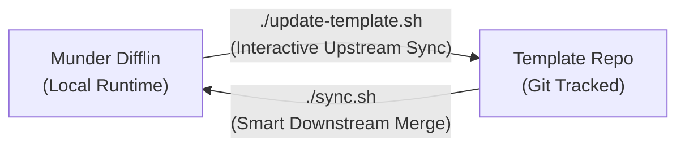

# Munder Difflin Agent Team Workspace Template

**English** · [繁體中文](README.zh-TW.md)

This project serves as the standard template repository for the **Munder Difflin (Hive Harness)** agent team collaboration environment.

---

## 🎯 Architecture & Design Philosophy

When running, Munder Difflin generates significant amounts of **ephemeral local runtime state** in its working directory (such as virtual terminal PTYs, the Unix domain socket `hooks.sock`, internal automated Git commits, task boards, and short-term agent memories).

To allow you to **use the exact same Agent Team roster across multiple computers while executing independent tasks on each machine**, this template strictly decouples team specifications from local runtime state:

* **Team Specifications (Git-tracked & Synchronized)**:
  * Agent team roster template (`roster.template.json`)
  * Agent personas and core system prompts (`hive/agents/<id>/identity.md`)
  * Communication hooks and proxy scripts (`hive/bin/`)
  * Collaboration protocol and CLI command reference (`hive/PROTOCOL.md`, `hive/COMMANDS.md`)
* **Local Runtime (Gitignored & Isolated per machine)**:
  * Current local state and terminal process IDs (`roster.json`, `hive/fleet.json`, `hive/registry.json`)
  * Task boards and active execution plans (`hive/tasks.json`, `hive/board.md`)
  * Message queues and long-term learned memories (`hive/agents/*/inbox/`, `outbox/`, `memory.md`)
  * Communication socket (`hive/hooks.sock`) and harness internal Git history (`hive/.git/`)

---

## 📁 Directory Structure

```text
munder-difflin-template/
├── .gitignore               # Excludes local dynamic files, sockets, and runtime state
├── README.md                # English documentation (default)
├── README.zh-TW.md          # Traditional Chinese documentation
├── roster.template.json     # Team roster template (models, commands, roles, descriptions)
├── sync.js                  # Smart merge script (merges template updates into local roster.json)
├── sync.sh                  # One-click pull & sync script (git pull + node sync.js)
├── update-template.js       # Interactive comparison script (diffs & imports local configs to template)
├── update-template.sh       # Shortcut for update-template.js
├── init.sh                  # First-time machine environment initialization script
└── hive/
    ├── PROTOCOL.md          # Hive agent collaboration protocol
    ├── COMMANDS.md          # Supported command reference
    ├── board.template.md    # Initial shared plan board template
    ├── tasks.template.json  # Initial task board template
    ├── bin/                 # Core interception hooks & proxy scripts
    │   ├── agy-hook.cjs
    │   ├── cth-hook.cjs
    │   ├── hive-node
    │   ├── hive-proxy.cjs
    │   └── runtime/node
    ├── spawn-requests/      # Dynamic agent spawn request queue (local isolation)
    └── agents/              # Agent configuration directories
        └── god/             # Orchestrator agent (Moo Cow)
            ├── identity.md  # Persona prompt (Git-tracked)
            ├── memory.template.md
            ├── inbox/       # Inbox queue (local isolation)
            └── outbox/      # Outbox queue (local isolation)
```

---

## 🚀 First-time Setup Guide

Follow these steps when setting up this Agent Team on a new computer:

### 1. Clone the Repository
Clone this repository to your target workspace path (e.g. `~/HarnessAgents`):
```bash
git clone <your-repo-url> ~/HarnessAgents
# Or navigate to your custom directory
cd ~/HarnessAgents
```

### 2. Run Initialization
```bash
./init.sh
```
This script will automatically:
1. Grant execute permissions to all required hook scripts.
2. Generate your machine-specific `roster.json` from `roster.template.json`, automatically resolving working paths to absolute paths on the current machine.
3. Scaffold initial mailbox queues and task boards.

### 3. Configure Munder Difflin Working Directory
* **Option A (Recommended)**: If Munder Difflin reads `~/HarnessAgents` by default, create a symbolic link:
  ```bash
  ln -s "$(pwd)" "$HOME/HarnessAgents"
  ```
* **Option B**: In Munder Difflin's configuration file (`~/Library/Application Support/munder-difflin/config.json`), set `"harnessHome"` to this workspace directory.

---

## 🔄 Team Synchronization & Upgrading



### Scenario A: Team Configs Adjusted on "Machine A" (Sync back to Template)
When you add new agents, adjust models, or update persona prompts via Munder Difflin's UI or locally, use the **interactive comparison script** to sync changes back into the template:

```bash
./update-template.sh
# Or specify an external harness directory: ./update-template.sh ~/HarnessAgents
```

The script will:
1. Compare your active `roster.json` against `roster.template.json`.
2. Compare agent persona files `hive/agents/<id>/identity.md` (supports pressing `d` for colored diff previews).
3. Interactively prompt you (`[Y/n]`) to choose whether to add new agents, update models/commands, or overwrite prompts.
4. Cleanse local runtime state (resets `ptyId` and `status`, normalizes absolute paths to `{{HARNESS_HOME}}`).
5. Ensure mailbox directory structures and `.gitkeep` files are generated for new agents.

Once confirmed, commit and push to GitHub:
```bash
git add .
git commit -m "feat: sync latest agent team configs to template"
git push
```

### Scenario B: Synchronize Latest Team on "Machine B" (Pull from Template)
To receive team upgrades on another machine, simply run:
```bash
./sync.sh
```
`sync.sh` will:
1. Pull the latest team definitions and prompts via `git pull --rebase`.
2. Execute `sync.js` to perform a **Smart Merge**:
   * Adds newly introduced agents to your local roster.
   * Updates existing agent models, commands, and settings.
   * **Preserves** all local runtime state (such as active terminal `ptyId`, local status, and in-flight tasks).
   * Scaffolds missing mailboxes and memory files for new agents.

---

## 💡 Important Notes

1. **Do NOT two-way sync active runtime directories via Dropbox / Cloud Storage**:
   Each machine runs independent task flows. Sockets (`hooks.sock`) and terminal IDs (`ptyId` in `roster.json`) are OS process-bound. Direct cloud synchronization of runtime directories will cause race conditions and app crashes.
2. **Memory Isolation**:
   `hive/agents/*/memory.md` is gitignored by default. This ensures agents keep their own clean long-term working context on each machine without stepping on one another.
